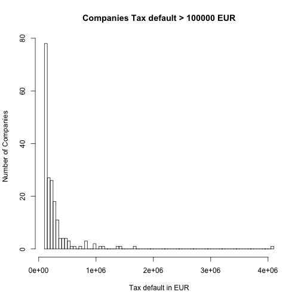

## Tax defaults historgram for large defaults

```r
hist(DT[TaxSumInDefault > 100000,TaxSumInDefault],breaks=100, xlab = "Tax default in EUR", ylab = "Number of Companies", main = "Companies Tax default > 100000 EUR")
```

 

Companies with defaults bigger than 100'000 EUR


